- Difficulty: Easy

- OS: Linux

- Author: LazyTitan333
  

An initial nmap scan reveals two open ports : `80` (HTTP) and `23` (SSH)

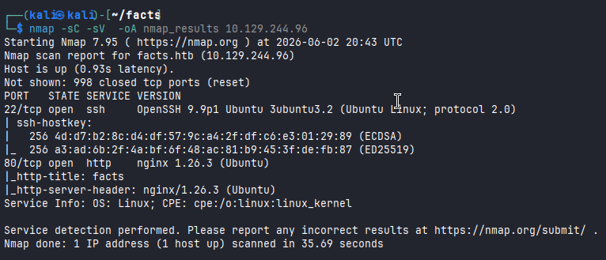

We start by exploring the web page :
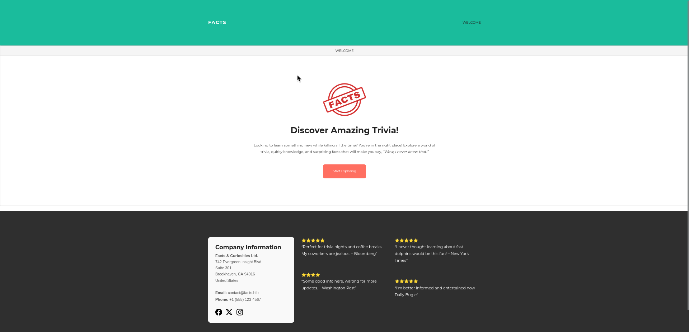

If we click `Start Exploring` we see a couple of facts , a search bar and a comments section. I browsed the facts and found nothing useful , except that the comments profiles are potential SSH usernames.
We opt for directory enumeration ,for instance, we can use ffuf :

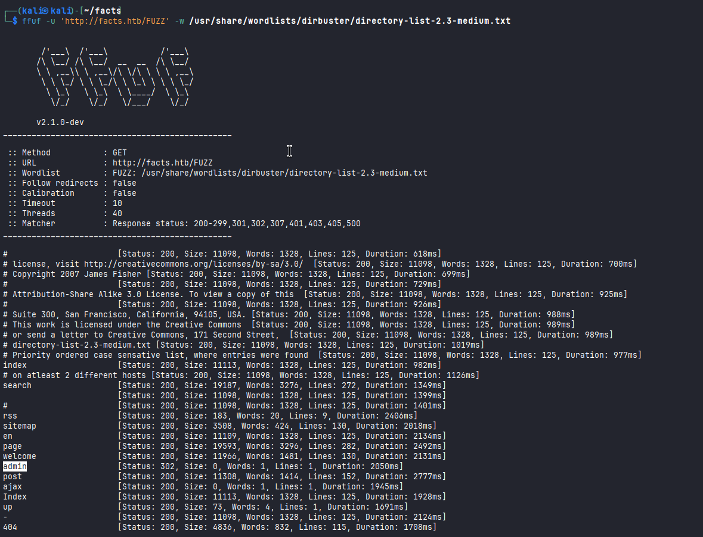
  

One output that catches the eye is /admin , visiting it redirects us to /admin/login : 
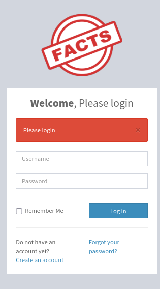

we create an account like this :
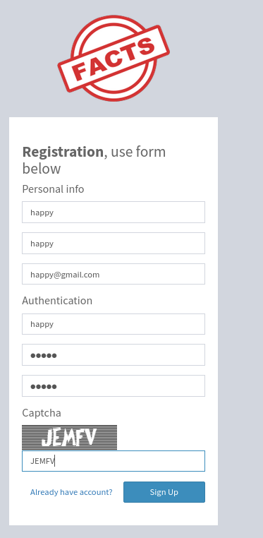

For a while we may think that we got administrator rights since it shows `Welcome to the Admin Panel`

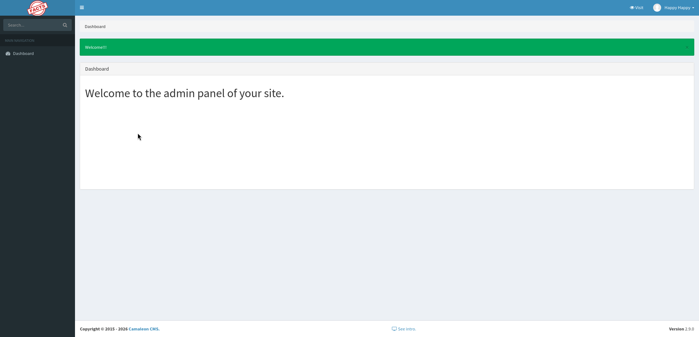

 but if we click the profile , our role is actually `client` ( Sadly ).
  

One thing worth noting is that the page is built using **Camaleon CMS** and that the version is `2.9.0`. Searching for a related CVE we find the **CVE-2024-46987** and here's the [PoC](https://github.com/Goultarde/CVE-2024-46987). This is an **LFI** that affects this version of Camaleon CMS too.

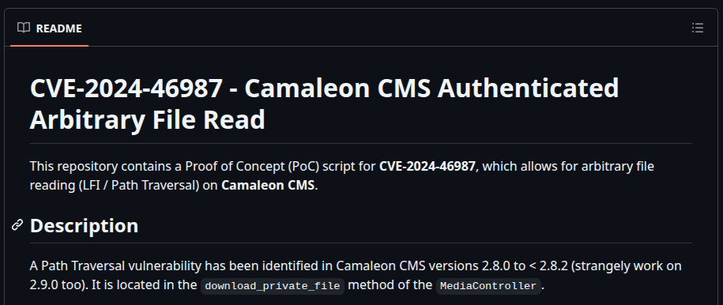
  

Reading the /etc/passwd , we see two users at the end `trivia` and `william`.

  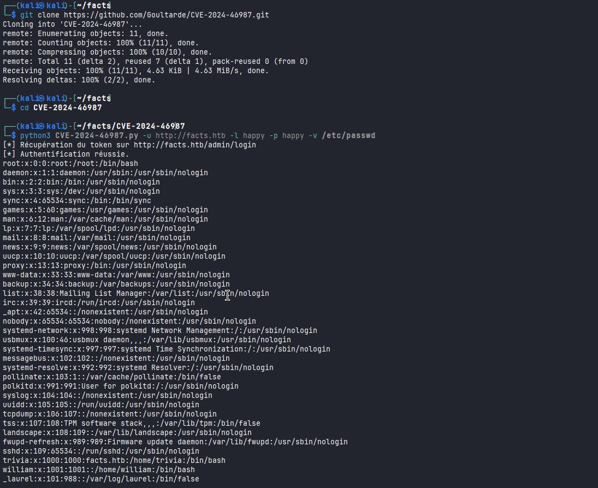
  

We can safely guess here and try to read the **user** flag :

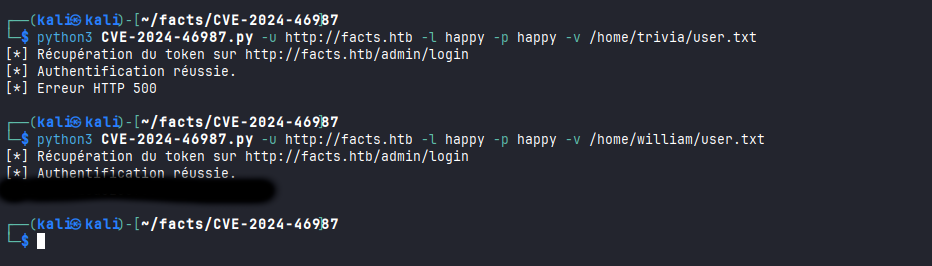

Since our initial Nmap scan revealed an open SSH port , I thought that we may take advantage of our `LFI` and find a private SSH key for one of these two users and this is what happened lol :

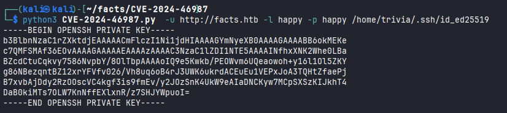
  

I already cracked the passphrase , so here is it :

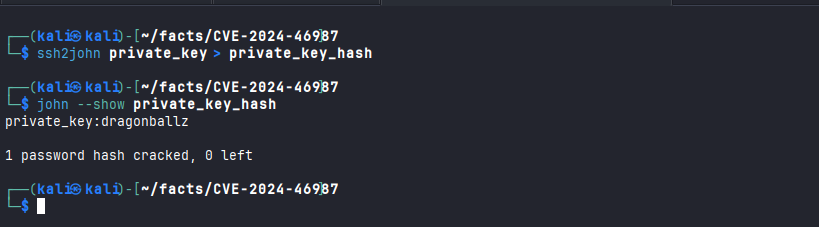

Now we can SSH into the user `trivia` and try to escalate our privileges :

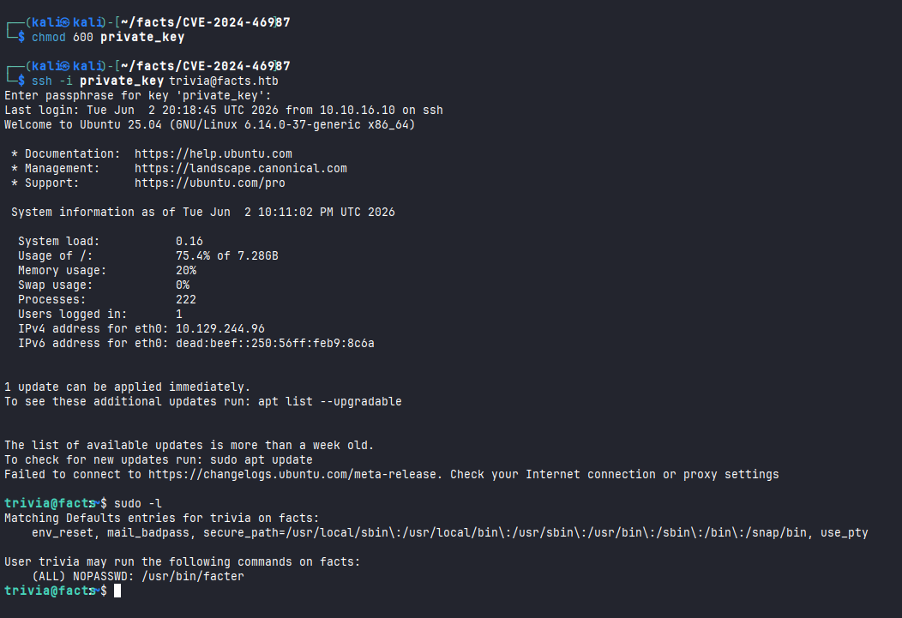

`sudo -l` reveals an important finding : the user `trivia` can execute `facter` without requiring a password : `(ALL) NOPASSWD: /usr/bin/facter`

  
The immediate intuition is to search in GTFOBins and figure out how to exploit binary :

  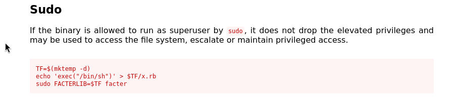
  
Oops, this didn't work :

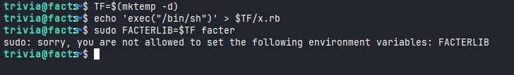
  
We noticed in the `sudo -l` that the "Environment Reset option" `env_reset` is set , this blocks custom FACTERLIB, but a quick search reveals that facter supports --external-dir , so this was our way in :

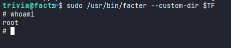

Et voilà! we come to the end of this machine . Thanks to the author for the fun machine.

**Note :**

We could've used the **CVE-2026-1776**'s PoC that represents a bypass of the incomplete fix for **CVE-2024-46987**

