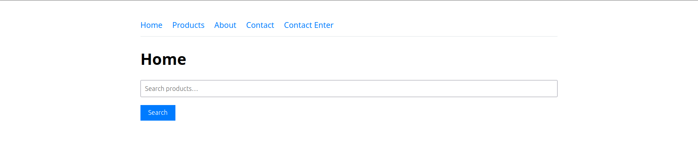
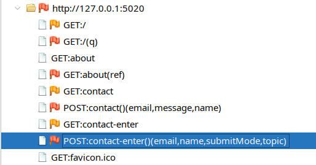
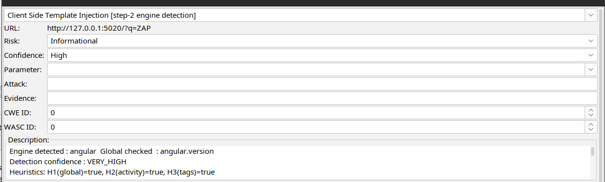
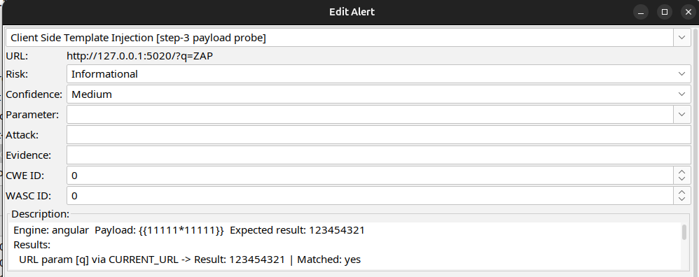

## Introduction

I started to work on this project as an intern at Djezzy Optimum Télécom Algérie SPA , under the supervision of Mr. [Beraoud Abdelkhalek](https://www.linkedin.com/in/abdelkhalek-beraoud-707567245/) who was behind the idea and  whose invaluable guidance, transformative advice, and remarkable patience supported the work throughout its development.

The active scan rule described here was built as an alpha rule for ZAP. You find the code [here](https://github.com/NabilKara/zap-extensions)

## Implementation basis : The CSTI-Alert paper

The methodology comes from the [paper](https://www.eurecom.fr/en/publication/8608) : `{{alert('CSTI')}}: Large-Scale Detection of Client-Side Template Injection`. The part we are concerned with  for this active scan rule  is not the large-scale crawling infrastructure itself, but the detection methodology:

1. Open the target in a real browser.
2. Detect whether a known client-side template engine is present through various methods as discussed later.
3. Look for evidence that the engine is actively used, not merely imported.
4. Select an engine-specific payload with a deterministic result.
5. Inject that payload.
6. Compare the rendered page before and after injection.

Thanks to the rich and huge ZAP ecosystem (Client Spider Add-On  , Selenium integration , Alerts model ... ) I focused only on fitting CSTI-Alert's browser-driven proof into ZAP's environment. 
## Architecture

The implementation is split into two classes: 
- `CstiActiveScanRule` which is the main class and contains the main features : active scan lifecycle, Client Spider integration, surface discovery, shared WebDriver management, URL and DOM probing, snapshot comparison, and alert generation.
- On the other side , `ClientSideEngineDetector` owns engine metadata: global identifiers, render and compile functions signatures ...


The rule extends `AbstractAppPlugin`, since the implementation is page oriented .

The browser model is shared across all the active scan rule instances. This can be considered a limitation but I opted for this choice because browser startup consumes too much resources, and CSTI probing may happen for many pages. The current code uses a static `AtomicReference<WebDriver>`, a lock, and an active-instance counter:

```java
private static final AtomicReference<WebDriver> sharedDriver = new AtomicReference<>(null);
private static final java.util.concurrent.locks.ReentrantLock browserLock =
        new java.util.concurrent.locks.ReentrantLock();

private static final Set<String> scannedKeys = ConcurrentHashMap.newKeySet();

private static final AtomicInteger activeInstances = new AtomicInteger(0);

private static final AtomicBoolean urlSetReady = new AtomicBoolean(false);
```

The rule also deduplicates scans by stripping query strings and fragments from the URL, which reduces browser work .

Browser selection is configurable through `rules.ascanalpha.csti.browserid`. Unsupported or unknown browser identifiers fall back to Firefox Headless. The code supports Firefox, Chrome, and Edge variants.

## More details on the methodology

The scan has six practical phases.

The first step is to use the `Client Spider` add-on to extract `input` , `textarea` components 
and query strings .

Following up some tests and discussions I made with the ZAP maintainers ( which were very helpful and nice btw ) I've concluded that the Client Spider has some gaps around textareas and submission nodes and doesn't report them. Therefore , my implementation supplements spider data by parsing the original HTML response for `textarea` tags. 

Engine detection loads the  page in the shared Selenium browser and delegates to `ClientSideEngineDetector.detect(driver, url)`. The detector first checks for known global objects, then searches for active render or compile calls, script template blocks, and template-specific DOM attributes.

Payload profile selection maps the detected engine to a `PayloadDefinition`. The current code has profiles for every engine in the detector's global map. Math-capable engines use arithmetic expressions based on `11111*11111`, which evaluates to `123454321`. Non-math engines use object-style payloads that expect `[object Object]`.

URL probing operates only on URL parameters belonging to the current page, not link-derived parameters for other pages. For each parameter, the scanner captures a baseline snapshot, replaces only that parameter value with the payload, loads the attack URL, then compares snapshots, we preserve other query parameters and fragments

```java
static String replaceParameterValue(String targetUrl, String paramName, String payload) {
    int queryIndex = targetUrl.indexOf('?');
    if (queryIndex < 0) {
        return null;
    }

    String base = targetUrl.substring(0, queryIndex);
    String fragment = "";
    String query = targetUrl.substring(queryIndex + 1);
    int fragmentIndex = query.indexOf('#');
    if (fragmentIndex >= 0) {
        fragment = query.substring(fragmentIndex);
        query = query.substring(0, fragmentIndex);
    }

    List<String> parts = new ArrayList<>();
    boolean replaced = false;
    for (String part : query.split("&", -1)) {
        if (part.isEmpty()) {
            parts.add(part);
            continue;
        }
        int equalsIndex = part.indexOf('=');
        String rawName = equalsIndex >= 0 ? part.substring(0, equalsIndex) : part;
        String decodedName = decodeQueryComponent(rawName);
        if (paramName.equals(decodedName)) {
            parts.add(rawName + "=" + URLEncoder.encode(payload, StandardCharsets.UTF_8));
            replaced = true;
        } else {
            parts.add(part);
        }
    }

    if (!replaced) {
        return null;
    }
    return base + "?" + String.join("&", parts) + fragment;
}
```

DOM input probing loads the page, locates candidate inputs by ID or name, injects the payload, dispatches `input`, `change`, `keyup`, and `blur`, fills other form fields with safe dummy values, and attempts same-origin form submission when there is no file input. 

A form may have multiple vulnerable fields , thus , when dealing with math-capable engines like `Angular` and `vue` , we send unique incremental payloads , therefore ,  vulnerable fields can be distinguished and reported appropriately. Non-math engines are probed one field at a time because `[object Object]` is not unique.

Alerting raises informational alerts for engine detection and payload probing, then raises a high-risk CSTI alert only when the expected result appears.

## Engine Detection and Confidence Scoring

The detector uses three heuristics. H1 is a global-object check, such as `angular.version`, `Vue`, `Handlebars`, or `nunjucks`. H2 is active usage evidence, found by searching inline scripts for render, compile, mount, controller, directive, or framework initialization signatures. H3 is template marker evidence, found through `script[type]` template blocks or DOM attributes such as `ng-app`, `v-model`, `x-data`, or `data-ember-action`.

The global check is implemented as browser-executed JavaScript over a dotted expression:

```java
private static final String GLOBAL_PROBE_PAYLOAD =
        "try {" +
                "  var parts = String(arguments[0]).split('.');" +
                "  var obj = window;" +
                "  for (var i = 0; i < parts.length; i++) {" +
                "    if (obj == null || obj === undefined) return false;" +
                "    obj = obj[parts[i]];" +
                "  }" +
                "  return obj !== undefined && obj !== null;" +
                "} catch (e) { return false; }";
```

The active-call corpus is collected from inline scripts and the full page HTML, then searched in Java:

```java
private static final String FUNCTION_CALL_PAYLOAD =
        "try {" +
                "  var scripts = document.querySelectorAll('script:not([src])');" +
                "  var src = '';" +
                "  for (var i = 0; i < scripts.length; i++) {" +
                "    src += scripts[i].textContent + '\\n';" +
                "  }" +
                "  return JSON.stringify({" +
                "    script: src," +
                "    html: document.documentElement.outerHTML" +
                "  });" +
                "} catch(e) { return '{}'; }";
```

The confidence score is deliberately not the vulnerability proof. It only describes how believable the engine detection is. The final high-risk alert still requires payload evidence.

```java
static EngineConfidence scoreEngineDetectionConfidence(
        ClientSideEngineDetector.DetectionResult engine) {

    boolean hasGlobal = engine.detected();
    boolean hasActivity = engine.hasActiveCalls();
    boolean hasTagEvidence = engine.hasTagEvidence();

    // Heuristic 3 is only applicable if the detected engine has known tag/script markers.
    boolean heuristic3Applicable = hasGlobal
            && ClientSideEngineDetector.isTagHeuristicApplicable(engine.engineName());

    if (hasGlobal && hasTagEvidence) {
        return EngineConfidence.VERY_HIGH;
    }

    if (hasGlobal && hasActivity) {
        return heuristic3Applicable ? EngineConfidence.HIGH : EngineConfidence.VERY_HIGH;
    }

    if (hasGlobal || hasTagEvidence) {
        return EngineConfidence.LOW;
    }

    return EngineConfidence.LOW;
}
```

The way is scored confidence is :
- global-only evidence is `low` confidence 
- global plus active usage is high for engines where tag evidence is expected but absent;
- global plus active usage is very high for engines without applicable tag markers;
- global plus script-type or attribute evidence is very high.

ZAP alert confidence then maps `LOW` to low, `HIGH` to medium, and `VERY_HIGH` to high. ( Didn't find a better choice)
## Payload Strategy

The arithmetic design centers on `11111*11111`. The expected result, `123454321`, is deterministic and uncommon enough to be useful as evidence. For engines with expression syntax, the delimiter changes but the operation stays the same. This lets the scanner keep confirmation logic simple: inject engine-specific syntax, then search for a common expected result.

The code models this as `PayloadDefinition(engineName, payload, expectedResult, kind)`. Math payloads support unique operands through `withOperand`, which is used during batch DOM probing:

```java
public PayloadDefinition withOperand(int operand) {
    if (!supportsUniqueOperands()) {
        return this;
    }
    String operandText = Integer.toString(operand);
    return new PayloadDefinition(
            engineName,
            payload.replace(Integer.toString(PROBE_OPERAND), operandText),
            Long.toString((long) operand * operand),
            kind);
}
```


The non-math entries are important. Those payloads cannot use unique operands, so the DOM probing code isolates them one field at a time.

## Baseline-Versus-Attack Snapshot Comparison

The rule does not treat "expected result appears somewhere" as sufficient evidence. It first counts occurrences of the expected result in the baseline page, then repeats the count after injection, this is done just in case , although the choice of payloads is unique to a certain extent , but we take this  edge case into consideration .
A probe only matches if the attacked snapshot exceeds the baseline in visible text or full HTML:

```java
private record ReflectionSnapshot(int textMatches, int htmlMatches) {
    boolean exceeds(ReflectionSnapshot other) {
        return textMatches > other.textMatches || htmlMatches > other.htmlMatches;
    }
}
```


```java
private static final String SNAPSHOT_PAYLOAD =
        "try {" +
                "  var expected = String(arguments[0] || '');" +
                "  function count(haystack, needle) {" +
                "    if (!haystack || !needle) return 0;" +
                "    var count = 0, index = 0;" +
                "    while ((index = haystack.indexOf(needle, index)) !== -1) {" +
                "      count++;" +
                "      index += needle.length;" +
                "    }" +
                "    return count;" +
                "  }" +
                "  var text = document.body ? document.body.innerText : '';" +
                "  var html = document.documentElement ? document.documentElement.outerHTML : '';" +
                "  return {" +
                "    textMatches: count(text, expected)," +
                "    htmlMatches: count(html, expected)" +
                "  };" +
                "} catch (e) { return { textMatches: 0, htmlMatches: 0, error: String(e) }; }";
```

## Page Settlement

Framework rendering is asynchronous , so  a page can report a successful navigation before client-side rendering has stabilized. The rule avoids fixed sleeps and instead uses a bounded `FluentWait` around a `MutationObserver`-backed readiness check ( custom Selenium explicit wait):

```java
public static boolean waitForPageToSettle(WebDriver driver) {
        try {
            Wait<WebDriver> wait =
                    new FluentWait<>(driver)
                            .withTimeout(CSTI_WAIT_TIMEOUT)
                            .pollingEvery(CSTI_POLL_INTERVAL)
                            .ignoring(WebDriverException.class);

            return Boolean.TRUE.equals(
                    wait.until(
                            d ->
                                    Objects.requireNonNull(((JavascriptExecutor) d)
                                            .executeScript(PAGE_SETTLED_PAYLOAD, DOM_QUIET_MILLIS))));
        } catch (TimeoutException e) {
            LOGGER.debug("CSTI: page did not fully settle within {}", CSTI_WAIT_TIMEOUT);
            return false;
        }
    }
```

 The function updates a timestamp whenever the DOM changes and returns true when `document.readyState === 'complete'` and the DOM has been quiet long enough:

```java
private static final String PAGE_SETTLED_PAYLOAD =
        "try {" +
                "  var quietMillis = Number(arguments[0] || 200);"
                + "  if (!window.__zapCstiWaitState) {"
                + "    window.__zapCstiWaitState = { lastMutation: Date.now() };"
                + "    new MutationObserver(function() {"
                + "      window.__zapCstiWaitState.lastMutation = Date.now();"
                + "    }).observe(document.documentElement || document, {"
                + "      subtree: true,"
                + "      childList: true,"
                + "      attributes: true,"
                + "      characterData: true"
                + "    });"
                + "  }"
                + "  var ready = document.readyState === 'complete';"
                + "  var domQuiet = Date.now() - window.__zapCstiWaitState.lastMutation >= quietMillis;"
                + "  return ready && domQuiet;"
                + "} catch (e) {"
                + "  return document.readyState === 'complete';"
                + "}";
```

## DOM Form Probing

DOM input probing is the most browser-dependent part of the implementation. The injected JavaScript finds targets by ID or name, adapts payload values for input types such as `email`, `url`, and `tel`, fills non-target fields with dummy values and finally dispatches the required events.

```java
                    "            if (!submitObserved) {" +
                    "              if (typeof form.requestSubmit === 'function') {" +
                    "                try {" +
                    "                  if (submitter) {" +
                    "                    form.requestSubmit(submitter);" +
                    "                  } else {" +
                    "                    form.requestSubmit();" +
                    "                  }" +
                    "                  submitObserved = true;" +
                    "                } catch (e) {}" +
                    "              }" +
                    "            }" +
                    "            if (!submitObserved && submitter) {" +
                    "              try {" +
                    "                submitter.click();" +
                    "                submitObserved = true;" +
                    "              } catch (e) {}" +
                    "            }" +
                    "            if (!submitObserved) {" +
                    "              try {" +
                    "                HTMLFormElement.prototype.submit.call(form);" +
                    "                submitObserved = true;" +
                    "              } catch (e) {}" +
                    "            }" +
```

The distinction between math and object payloads affects probing strategy:

```java
private List<ProbeResult> probeDomInputs(
        WebDriver driver,
        String pageUrl,
        List<InputSurface> inputSurfaces,
        ClientSideEngineDetector.PayloadDefinition payloadDefinition,
        List<String> attempts) {

    if (payloadDefinition.supportsUniqueOperands()) {
        return probeDomInputsWithUniquePayloads(driver, pageUrl, inputSurfaces, payloadDefinition, attempts);
    }

    return probeDomInputsIndividually(driver, pageUrl, inputSurfaces, payloadDefinition, attempts);
}
```


## Some screenshots

The following screenshots illustrate the rule in action : 



The local demo application contains routes backed by different client-side template engines.



The Client Spider discovers browser-side components such as inputs and links, which the CSTI rule later uses as candidate injection surfaces.



The engine detection alert reports the detected engine, the matched global object, and the heuristic evidence used to score confidence.



The reflection results show the payload probing phase, where the rule compares the baseline page with the attacked page and reports a match only when the expected evaluated result appears.

## Conclusion 
This has been a brief walkthrough of the work I've done so far, looking forward for the review ZAP maintainer's so it can eventually be integrated into the ZAP codebase.